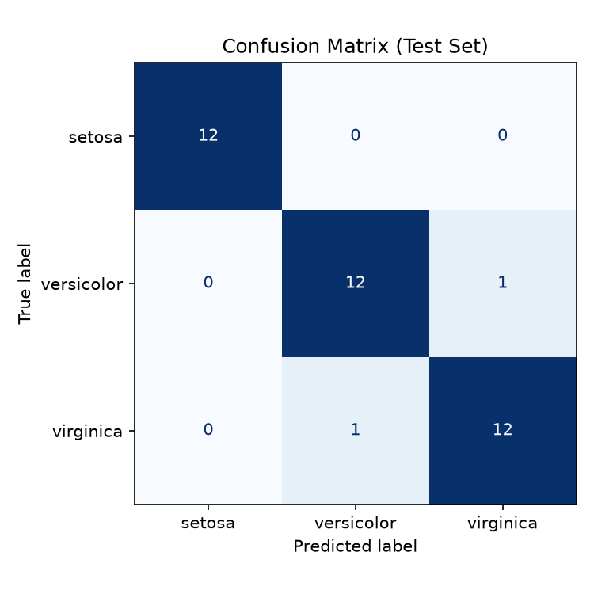
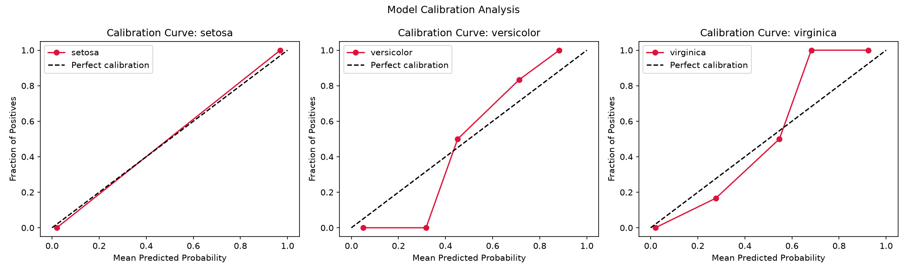

# Performance Report — Iris Classification

## Model
Logistic regression trained on the Iris dataset (150 samples, 75/25 train/test split).

**Test accuracy: 0.947  -- 94.7%**

## Confusion Matrix

Errors are concentrated between *versicolor* and *virginica*, the two species
that are most similar in petal size.

## Calibration

The model is well-calibrated for *setosa*; for the other two classes, the
predicted probabilities deviate somewhat more from the ideal diagonal.

## Conclusion
The pipeline trains and evaluates correctly. The remaining error is explained
by the natural overlap between two of the three species, also visible in the
exploration notebook.